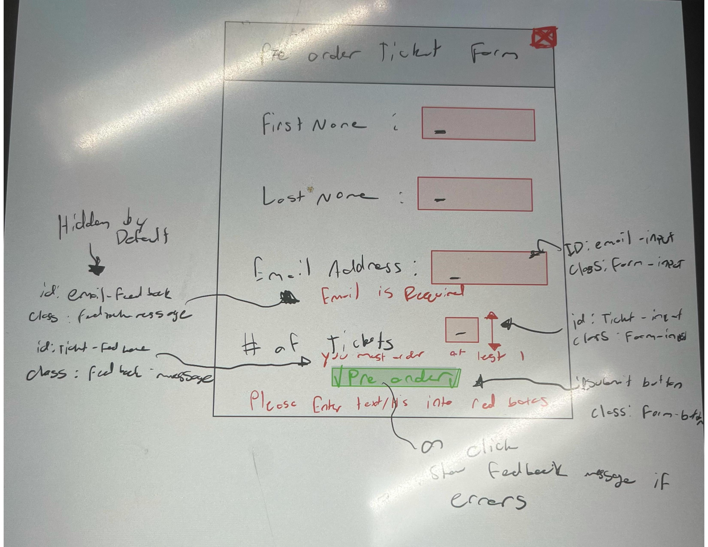

# Form Feedback Interactivity Planning

## _Planning_ Sketch(es)

### Pseudocode Plan

When the user clicks on the "Pre-Order" Button (id: submit-button):
1. Retrieve the value from the email input field (id: email-input)
2. Retrieve the value of the # of tickets (id: ticket-input)
3. If the email-input is empty then make the email feedback message visible (id: email feedback)
4. If the ticket-input field is empty then make the ticket feedback message visible (id: ticket-feedback)

## Form Feedback Interactivity Critique

- Affordances

The form has clear and straightforward labels for each field, helping to guide the user through the form completion process.

- Visibility

The feedback messages are not visible as the default setting, ensuring that the user is not unnecessarily confused by the form.

- Feedback

My feedback messages are simple and get to the point, avoiding unnecessary information.

- Familiarity

The form elements that I chose to include are common on many fields and would provide a sense of familiarity to the user. 
